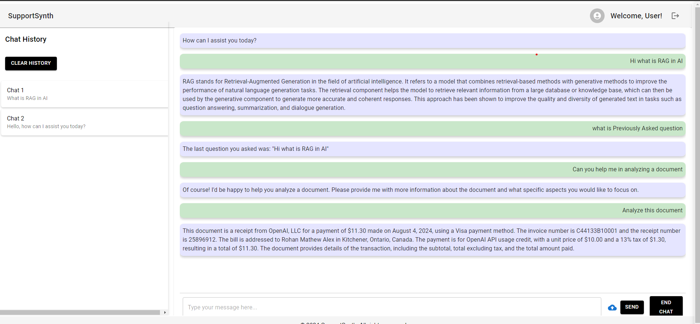

# SupportSynth

SupportSynth is an AI-powered chat application designed to enhance customer support interactions. Built with a modern tech stack, it offers features such as user authentication, chat history retrieval, document analysis, and more.

## Table of Contents

- [Features](#features)
- [Tech Stack](#tech-stack)
- [Installation](#installation)
- [Usage](#usage)
- [API Endpoints](#api-endpoints)
- [Deployment](#deployment)
- [Contributing](#contributing)
- [License](#license)
- [Acknowledgments](#acknowledgments)

## Features

- **User Authentication**: Secure login and registration system.
- **Real-Time Chat Interaction**: AI-powered chatbot for seamless user support.
- **Retrieve Chat History**: Access previous chat sessions easily.
- **Ask Previously Asked Questions**: Retrieve answers to past inquiries.
- **End Chat Sessions**: Save and conclude chat sessions.
- **Clear Chat History**: Privacy feature to clear chat history.
- **Document Analysis**: Upload and analyze documents within the chat.

## Tech Stack

- **Frontend**: React + TypeScript, Material-UI for responsive design.
- **Backend**: Node.js, Express, MongoDB.
- **AI Integration**: OpenAI for intelligent and context-aware chatbot responses.
- **Deployment**: 
  - Frontend: Vercel
  - Backend: Render

## Installation

### Prerequisites

- Node.js (v14 or higher)
- MongoDB

### Backend Setup

1. Clone the repository:

   \`\`\`bash
   git clone https://github.com/yourusername/supportsynth.git
   cd supportsynth
   \`\`\`

2. Navigate to the `backend` directory:

   \`\`\`bash
   cd backend
   \`\`\`

3. Install the dependencies:

   \`\`\`bash
   npm install
   \`\`\`

4. Create a `.env` file in the `backend` directory and add your environment variables:

   \`\`\`bash
   MONGO_URI=your_mongo_uri
   JWT_SECRET=your_jwt_secret
   OPENAI_API_KEY=your_openai_api_key
   \`\`\`

5. Start the backend server:

   \`\`\`bash
   npm start
   \`\`\`

### Frontend Setup

1. Navigate to the `frontend` directory:

   \`\`\`bash
   cd frontend
   \`\`\`

2. Install the dependencies:

   \`\`\`bash
   npm install
   \`\`\`

3. Create a `.env` file in the `frontend` directory and add your environment variables:

   \`\`\`bash
   REACT_APP_API_BASE_URL=https://supportsynth.onrender.com/api
   \`\`\`

4. Start the frontend development server:

   \`\`\`bash
   npm start
   \`\`\`

## Usage

- Visit the application in your browser (default: \`http://localhost:3000\`).
- Register or log in to start a chat session.
- Interact with the AI-powered chatbot, retrieve previous conversations, analyze documents, and more.

## API Endpoints

### Authentication

- **POST** \`/api/auth/register\` - Register a new user.
- **POST** \`/api/auth/login\` - Log in a user and return a JWT token.

### Chat

- **POST** \`/api/chat/respond\` - Send a message to the chatbot and receive a response.
- **POST** \`/api/chat/end\` - End the current chat session.
- **DELETE** \`/api/chat/clear\` - Clear the chat history.
- **GET** \`/api/chat/history\` - Retrieve the chat history.

### Document Analysis

- **POST** \`/api/upload/upload-and-query\` - Upload a document and analyze it based on a query.

## Deployment

### Vercel (Frontend)

1. Deploy the frontend on Vercel by connecting your GitHub repository.
2. Ensure environment variables are set in the Vercel project settings.

### Render (Backend)

1. Deploy the backend on Render by connecting your GitHub repository.
2. Set the necessary environment variables in the Render dashboard.

## Contributing

Contributions are welcome! Please follow these steps:

1. Fork the repository.
2. Create a new branch (\`git checkout -b feature-branch\`).
3. Make your changes and commit them (\`git commit -m 'Add some feature'\`).
4. Push to the branch (\`git push origin feature-branch\`).
5. Open a Pull Request.

## License

This project is licensed under the MIT License. See the [LICENSE](LICENSE) file for details.

 
